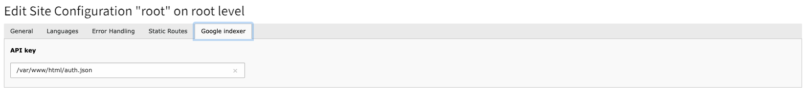

# TYPO3 Extension GoogleIndexer

### ABSTRACT

**Our solution allows for faster indexing of pages and removing them from the Google index. Until now, we had two options to notify Google search engine about a new page. The first method was using Google Search Console. The second, more time-consuming method, was waiting for the Google bot to visit the page and index it. Do it faster and in one step in the TYPO3 administrative panel.**

Google provides an indexing service called Google Indexing API that allows developers to submit individual URLs directly to Google for crawling and indexing. This API is designed for specific use cases where websites or applications require immediate indexing of new or updated content.
The Google Indexing API helps website owners or developers ensure that their content is quickly discovered and indexed by Google's search engine. By using the API, developers can request Google to crawl and index specific URLs, which can be useful for time-sensitive or dynamically generated content.

##  Feature overview
* TYPO3 12 compatibility
* Based on TYPO3 pages
* Supports multi domain setup
* Supports multi-language websites

## Screenshots

### Check history

### Update

## Main function

 * Button **"Update"** - Inform Google about a new URL to crawl or notify them that the content on a previously-submitted URL has been updated.
 * Button **"Remove"** - Once you have deleted a page from your servers, please notify Google to ensure the page is promptly removed from our index and to prevent any further crawling attempts on the corresponding URL.
 * Button **"Check status"** - Obtain the status of a request by checking the most recent time Google received each type of notification for a specific URL.

## Installation
Get this extension via `composer req drblitz/google-indexer`.

## Configuration
 * Open the [Service accounts page](https://console.cloud.google.com/iam-admin/serviceaccounts "ervice accounts page"). If prompted, select a project.
 * Click add Create Service Account, enter a name and description for the service account. You can use the default service account ID, or choose a different, unique one. When done click Create.
 * The Service account permissions (optional) section that follows is not required. Click Continue.
 * On the Grant users access to this service account screen, scroll down to the Create key section. Click add Create key.
 * In the side panel that appears, select the format for your key: JSON is recommended.

## Upload json config file
After downloading the JSON file, please go to TYPO3 -> Site Management -> Sites -> Edit site configuration -> Google Indexer and provide an absolute path to this file. If you have multiple pages, you can provide a different config file for each of them. It is recommended to keep this file outside of the public directory.

## 2. Grant owner status to your service account
* Open the [Google Search Console](https://search.google.com/search-console/)
* Click the property for which you verified ownership.
* In the **Verified owner list**, click **Add an owner**.
* Provide your service account email as the delegated owner. You can find your service account email address in two places:
  * The client_email field in the JSON private key that you downloaded when you created your project.

The email address has a format like this:  
For example: my-service-account@test-project-42.google.com.iam.gserviceaccount.com
